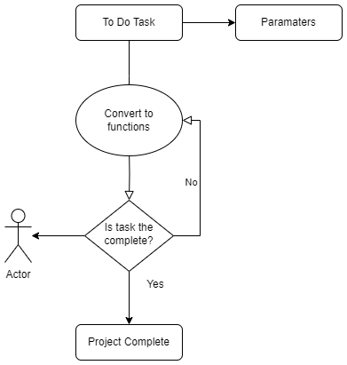

# Summary: 

The goal of this project is to utilize LMMs to build software or to operationalize tasks for the user. This project is inspired by AutoGPT with a few key differences:

- The prompts are outputted to functions which believe should yield to greater accuracy
- This will be customizable on the user level where one can input the level of user feedback
- This should less costly then AutoGPT since this will parameters where we can WizGPT from running (e.g only run 10 prompts before receiving human feedback)
- We will eventually be able to estimate the cost of running the LLM before deploying the script 

The customizable level will be available within the settings parameters. 

**Example 1#:** Minimal Hands Off Process 

Let’s say a user would like to build a website about your dog's 13th birthday. 

This user has minimal background in web development and doesn't care as much of what the final product will look like. 

They would put in the following: 

- **Prompt:** I need a website for my 13th year old dog named Sammy. 
- **Hands_off_level** = 1
- **max_number_of_prompts** = 100
- **Cost** => $100

The program will then run until the project is complete or until one of the parameters are met which will ask for user’s feedback again. 

This will also give the user detailed advice on how to register the domain and good advice on which place would be a good host for them (e.g wordpress)

For more information on the parameters, see the parameters section 

**Example #2:** Somewhat Hands Off 

Let’s say a user would like to build an app that will identify a picture of Nicolas Cage or not. 

This user is somewhat familiar with app development and somewhat cares as much of what the final product will look like. 

They would put in the following: 

- **Prompt:** I need to build an app that will identify if a picture of us is of Nicolas Cage or not. 
- **Input:** pictures_of_nic_cage.zip 
- **Hands_off_level** = 3
- **max_number_of_prompts** = 20
- **Cost** => $20

WizGpt will then run 20 prompts and when it’s complete the user will inspect the code and ask it to continue. If the user doesn’t like the code, they can either redo it themselves or ask WizGpt to do it again. 

For more information on the parameters, see the parameters section 

**Example #3:** Mostly Hands Off 

Let’s say a seasoned data scientist would like to monitor model drift dashboard for their local business with specific parameters. 

This user is familiar with data science and very much cares as much about what the final product will look like. 

They would put in the following: 

- **Prompt:** I’m building a model drift dashboard for two of the models. The name of the models are Make_money.pickel, and make_alot_of_money.pickel. I want you to scan the folder folder_name_of_your_project, and I want you to output the results in power bi and if there’s any future issue, I want you to set up an email notification to my email alerting me of anything. I also want the alert system to be ranked, where model failure should be labeled as important and anything else as normal.  
- **Input:** model_names, folder_name_of_your_project, my_corp_email@corp.xyz, power_bi.exe 
- **Hands_off_level** = 9
- **max_number_of_prompts** = 5
- **Cost** => $100

WizGpt will then run 5 prompts at a time and then the data scientist will scan each 5 prompts when it’s complete the user will inspect the code and ask it to continue. If the user doesn’t like the code, they can either redo it themselves or ask WizGpt to do it again. 

For more information on the parameters, see the parameters section 

# Flow chart 



# Key Distinctions From AutoGPT

# Parameters

# Known Issues 

# Project Status 

We are currently in the process of creating benchmarks of what WizGPT would need to complete in order for us to move to the next iterations. 

Some examples include:

- Create a basic website 
- Create a game of tick tac toe 
- Analyse an excel sheet

# Sudo Code

```

``` sh
$ python3 main.py
"{\"env\": {\"imports\": null, \"specs\": null, \"impls\": null}, \"comment\": \"use docker to run cowsay with the 42nd Fibonacci number\", \"sig\": {\"name\": \"run_fib42_in_docker\", \"returnType\": \"str\", \"args\": []}}"{
  "sig": {
    "returnType": "str",
    "name": "run_fib42_in_docker",
    "args": []
  },
  "impl": "fib42 = compute_nth_fibonacci(42)\n\nresult = execute_docker_cowsay(fib42)",
  "env": {
    "imports": [
      {
        "name": "subprocess",
        "alias": null,
        "pip_install": null
      }
    ],
    "specs": [
      {
        "env": {
          "imports": null,
          "specs": null,
          "impls": null
        },
        "sig": {
          "returnType": "int",
          "name": "compute_nth_fibonacci",
          "args": [
            {
              "name": "n",
              "argtype": "int"
            }
          ]
        },
        "comment": "compute the nth Fibonacci number"
      },
      {
        "env": {
          "imports": [
            {
              "name": "subprocess",
              "alias": null,
              "pip_install": null
            }
          ],
          "specs": null,
          "impls": null
        },
        "sig": {
          "returnType": "str",
          "name": "execute_docker_cowsay",
          "args": [
            {
              "name": "message",
              "argtype": "str"
            }
          ]
        },
        "comment": "run the cowsay command in a Docker container with the specified message"
      }
    ],
    "impls": null
  }
}fib42 = compute_nth_fibonacci(42)

result = execute_docker_cowsay(fib42)
compute_nth_fibonacci is not defined. implementing...
"{\"env\": {\"imports\": null, \"specs\": null, \"impls\": null}, \"comment\": \"compute the nth Fibonacci number\", \"sig\": {\"name\": \"compute_nth_fibonacci\", \"returnType\": \"int\", \"args\": [{\"argtype\": \"int\", \"name\": \"n\"}]}}"{
  "sig": {
    "name": "compute_nth_fibonacci",
    "returnType": "int",
    "args": [
      {
        "name": "n",
        "argtype": "int"
      }
    ]
  },
  "impl": "if n == 0:\n    result = 0\nelif n == 1:\n    result = 1\nelse:\n    a, b = 0, 1\n    for _ in range(n - 1):\n        a, b = b, a + b\n    result = b",
  "env": {
    "imports": null,
    "specs": null,
    "impls": null
  }
}arg 0: 42if n == 0:
    result = 0
elif n == 1:
    result = 1
else:
    a, b = 0, 1
    for _ in range(n - 1):
        a, b = b, a + b
    result = b
execute_docker_cowsay is not defined. implementing...
"{\"env\": {\"imports\": [{\"name\": \"subprocess\", \"alias\": null, \"pip_install\": null}], \"specs\": null, \"impls\": null}, \"comment\": \"run the cowsay command in a Docker container with the specified message\", \"sig\": {\"name\": \"execute_docker_cowsay\", \"returnType\": \"str\", \"args\": [{\"argtype\": \"str\", \"name\": \"message\"}]}}"{
  "sig": {
    "returnType": "str",
    "name": "execute_docker_cowsay",
    "args": [
      {
        "name": "message",
        "argtype": "str"
      }
    ]
  },
  "impl": "docker_command = f'docker run -it --rm docker/whalesay cowsay {message}'\nresult = subprocess.getoutput(docker_command)",
  "env": {
    "imports": [
      {
        "name": "subprocess",
        "alias": null,
        "pip_install": null
      }
    ],
    "specs": null,
    "impls": null
  }
}arg 0: 267914296docker_command = f'docker run -it --rm docker/whalesay cowsay {message}'
result = subprocess.getoutput(docker_command)
 ___________
< 267914296 >
 -----------
                                   ##        .
              ## ## ##       ==
           ## ## ## ##      ===
       /""""""""""""""""___/ ===
  ~~~ {~~ ~~~~ ~~~ ~~~~ ~~ ~ /  ===- ~~~
       \______ o          __/
        \    \        __/
          \____\______/

```
b
```

```

```
